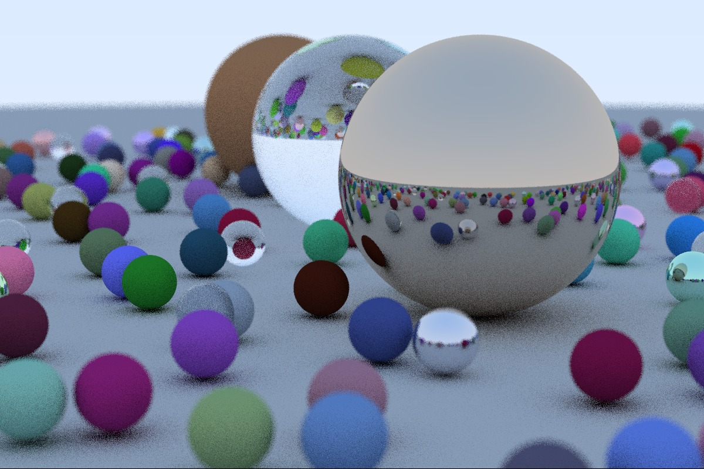
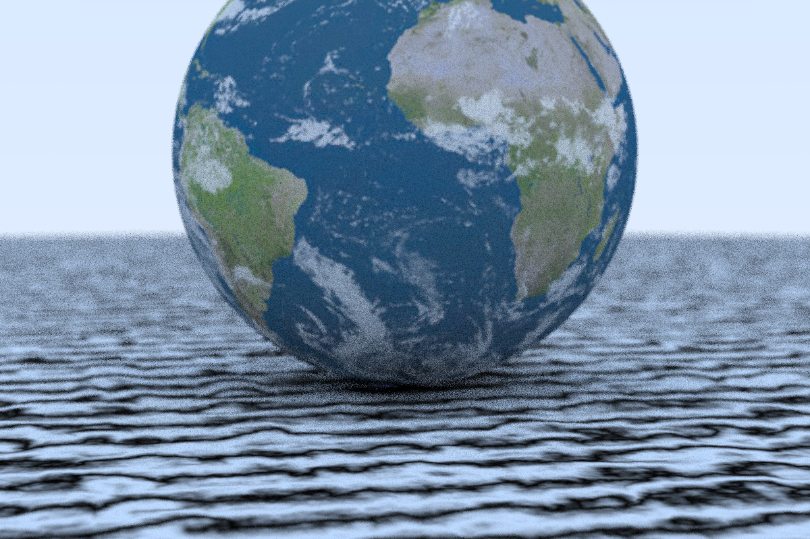

# Raytracer

A simple raytracer in Rust to learn the language.

## Features implemented:
- Antialiasing
- Diffuse materials
- Metal materials
- Dielectric materials
- Positionable camera
- Defocus blur (or depth of field)
- Motion blur
- Texture (constant texture, checker texture, perlin noise texture, image texture)
- Bounding volume hierarchy partitioning with bounding boxes

## Sample output

Here is the first version of the raytracer:

Here is the second version of the raytracer:

